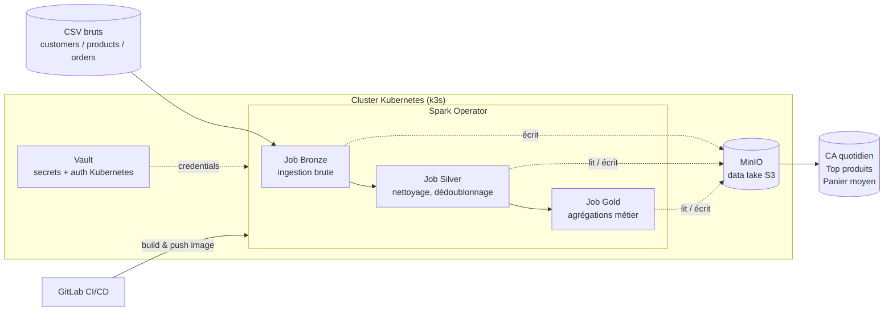

# Spark Medallion Demo — Pipeline de données e-commerce sur Kubernetes

Pipeline de données batch en architecture **Medallion (Bronze / Silver / Gold)**, construit sur Kubernetes de bout en bout : ingestion, nettoyage, agrégations métier, secrets gérés via Vault, déploiement via Spark Operator, CI/CD GitLab.

L'objectif n'était pas de faire tourner un job Spark isolé, mais d'industrialiser un pipeline data avec les pratiques d'une vraie plateforme : gestion des secrets, data lake S3-compatible, traçabilité, CI/CD.

---

## Architecture



**Principe medallion :**

| Couche | Rôle | Contenu |
|---|---|---|
| **Bronze** | Ingestion brute, sans transformation métier | CSV → Parquet, avec métadonnées de traçabilité (`_ingested_at`, `_source_file`) |
| **Silver** | Données nettoyées et fiables | Dédoublonnage, typage correct, suppression des valeurs invalides |
| **Gold** | Insights métier directement exploitables | CA quotidien, top produits, panier moyen par client |

---

## Stack technique

- **Apache Spark 3.4** (PySpark) sur **Kubernetes** via le [Spark Operator](https://github.com/kubeflow/spark-operator)
- **MinIO** comme data lake S3-compatible (déployé via MinIO Operator)
- **HashiCorp Vault** pour l'authentification Kubernetes et la gestion des secrets (auth backend configuré et validé — intégration à la chaîne applicative en cours)
- **GitLab CI/CD** pour le build et la publication des images Docker
- Cluster **k3s** mono-node (environnement de développement)

---

## Résultats concrets

Jeu de données synthétique généré avec incohérences volontaires (doublons, valeurs nulles) pour valider le nettoyage :

| Métrique | Bronze | Silver | Gold |
|---|---|---|---|
| Clients | 200 | 199 (1 email invalide retiré) | 200 paniers moyens calculés |
| Commandes | 5 060 | 5 000 (60 doublons supprimés) | 271 jours de CA agrégés |
| Produits | 8 | 8 | 8 classés par volume de vente |

---

## Lancer le pipeline

```bash
# 1. Générer le jeu de données
python3 data-generator/generate_data.py

# 2. Build et publication de l'image (via CI, ou manuellement)
docker build -f Docker/Dockerfile -t spark-medallion-demo:v1 .

# 3. Déployer l'infrastructure (MinIO tenant, ServiceAccount, RBAC)
kubectl apply -f minio/minio-tenant.yaml

# 4. Lancer le pipeline dans l'ordre
kubectl apply -f bronze-sparkapp.yaml
kubectl apply -f silver-sparkapp.yaml
kubectl apply -f gold-sparkapp.yaml

# 5. Vérifier
kubectl get sparkapplication -n spark-medallion-demo
```

---

## Défis rencontrés (et comment ils ont été résolus)

Ce projet n'a pas suivi une ligne droite — plusieurs obstacles réels d'infrastructure ont dû être diagnostiqués et corrigés :

- **Dépréciation des images Docker MinIO** : MinIO a arrêté de publier ses images gratuites sur Docker Hub en cours de route (risque de supply chain concret). Bascule vers un mirror maintenu (Chainguard) après diagnostic.
- **Namespace containerd vs Docker** : une image buildée en local avec `docker build` restait invisible pour K3s (runtime containerd, store séparé). Résolu par un import explicite dans le namespace `k8s.io`.
- **Vault seal/unseal** : sans auto-unseal configuré, chaque redémarrage du pod Vault re-scelle le stockage et bloque l'injection de secrets — limite documentée plutôt que masquée.
- **Dimensionnement CPU Kubernetes** : `cores` et `coreLimit` sont deux champs distincts du Spark Operator ; une requête CPU supérieure à la limite fait rejeter le pod par l'API Server.

---

## Prochaines étapes

- [ ] Réintégrer l'injection de secrets Vault sur les jobs Spark (auth Kubernetes déjà validée)
- [ ] GitOps avec ArgoCD pour le déploiement des `SparkApplication`
- [ ] Scan de sécurité des images (Trivy) dans le pipeline CI
- [ ] Auto-unseal Vault via KMS

---

